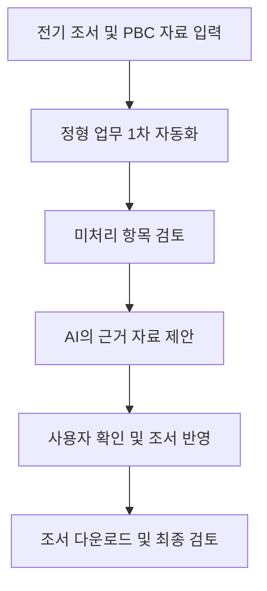
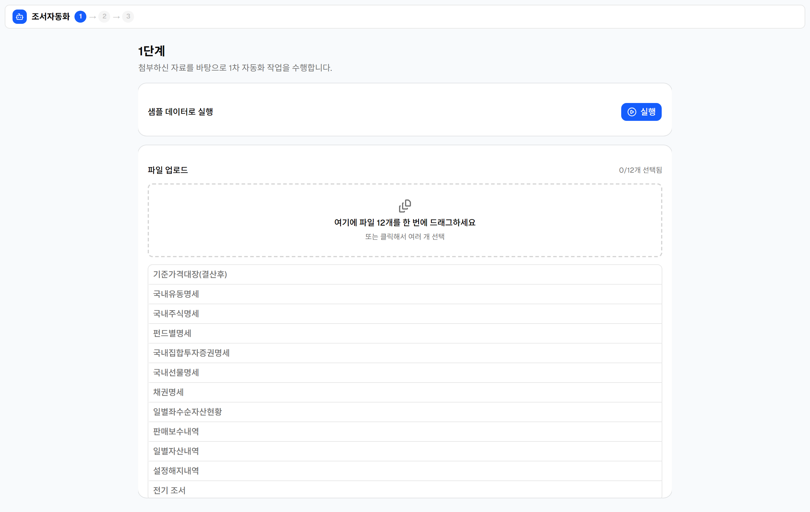
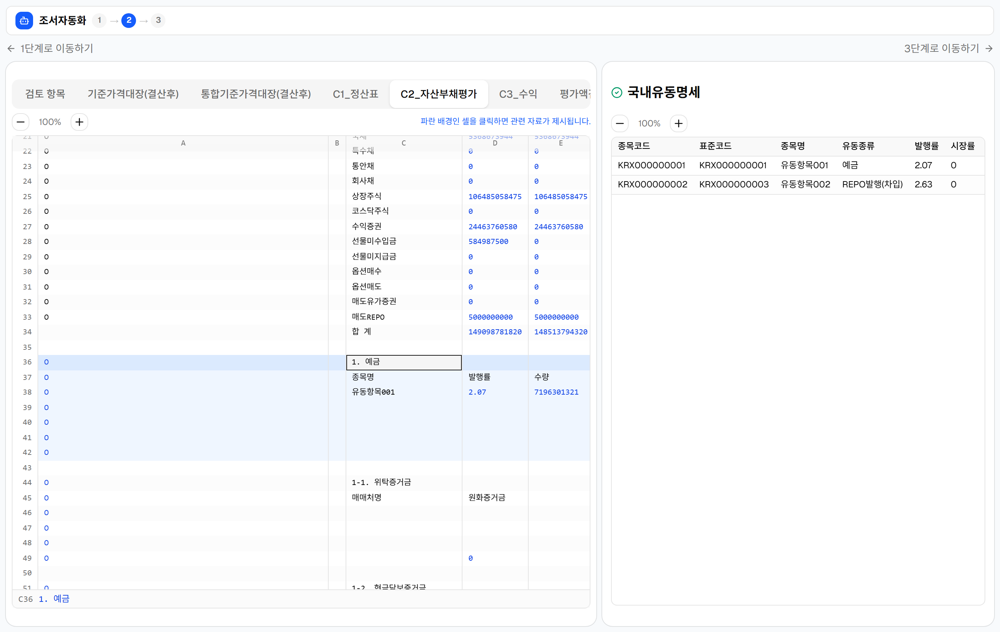
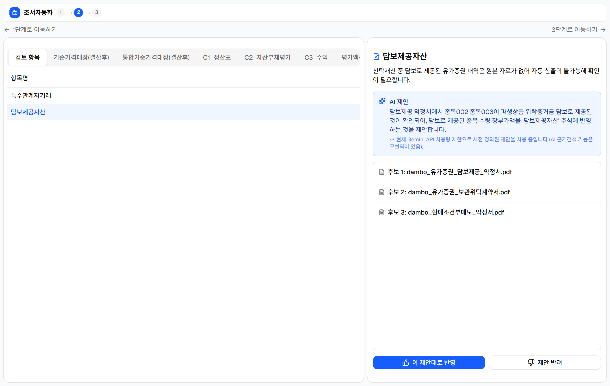
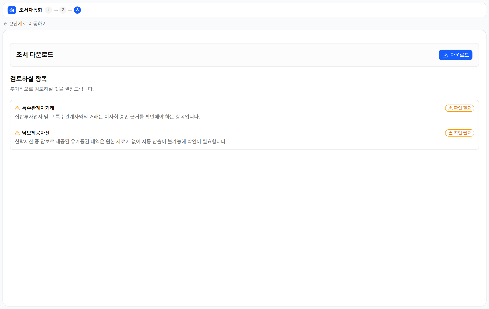

# 조서 준자동화 프로그램

> 학습용 전기 조서와 PBC 자료를 바탕으로 반복적인 조서 작성 업무를 자동화하고, 비정형 업무는 AI의 근거 제안과 사용자의 검토·승인을 통해 지원하는 웹 애플리케이션 프로토타입입니다.

- 🔗 **라이브 데모: https://fund-audit-wp-automation.onrender.com** (무료 호스팅이라 한동안 미접속 시 첫 화면이 뜨는 데 잠깐 걸릴 수 있습니다)
- 개발 형태: 개인 프로젝트
- 현재 단계: 한 가지 자료 형식을 기준으로 주요 기능을 구현한 프로토타입
- 사용 데이터: 기능 확인용 학습용 조서 및 PBC 자료 한 세트

## 목차

1. [프로젝트 개요](#1-프로젝트-개요)
2. [개발 배경과 문제 정의](#2-개발-배경과-문제-정의)
3. [핵심 설계 원칙](#3-핵심-설계-원칙)
4. [업무 구분과 처리 방식](#4-업무-구분과-처리-방식)
5. [사용 흐름 및 주요 기능](#5-사용-흐름-및-주요-기능)
6. [결과 검증 구조](#6-결과-검증-구조)
7. [주요 화면](#7-주요-화면)
8. [기술 구성](#8-기술-구성)
9. [실행 방법](#9-실행-방법)
10. [학습용 데이터 안내](#10-학습용-데이터-안내)
11. [현재 구현 범위와 한계](#11-현재-구현-범위와-한계)
12. [향후 개선 계획](#12-향후-개선-계획)
13. [개발 과정과 담당 역할](#13-개발-과정과-담당-역할)

## 1. 프로젝트 개요

조서 작성에는 전기 조서와 당기 PBC 자료를 비교해 값을 옮기거나, 여러 자료에서 근거를 찾아 조서에 반영하는 작업이 포함됩니다. 이 프로젝트는 이러한 반복 업무에 사용하는 시간을 줄이고, 회계사가 직접 확인하거나 판단해야 하는 항목에 집중할 수 있도록 돕기 위해 시작했습니다.

모든 업무를 한 번에 자동화하기보다 현재의 지식과 데이터로 안정적으로 처리할 수 있는 범위를 먼저 구분했습니다. 정형화된 반복 업무는 자동으로 처리하고, 비정형 자료에서 근거를 찾아야 하는 업무는 AI가 관련 자료를 제안한 뒤 사용자가 확인하도록 했습니다. 회계적 판단이 필요한 업무는 자동으로 처리하지 않고 별도의 검토 항목으로 안내합니다.

## 2. 개발 배경과 문제 정의

실무 경험이 있는 회계사에게 조서 작성 절차를 배우며 다음과 같은 문제에 주목했습니다.

- 전기 조서와 당기 PBC 자료 사이의 값을 반복적으로 옮겨야 합니다.
- 필요한 근거를 확인하기 위해 여러 PBC 파일과 페이지를 직접 찾아야 합니다.
- 자료의 형식이 일정하지 않아 모든 업무에 동일한 자동화 규칙을 적용하기 어렵습니다.
- 일부 항목은 자료를 확인하는 것만으로 처리할 수 있지만, 일부는 회계적 판단이 필요합니다.

따라서 단순히 조서를 자동으로 완성하는 것보다, **자동화할 수 있는 업무와 회계사가 직접 검토해야 하는 업무를 구분하고 자동화 결과의 근거를 확인할 수 있게 하는 것**을 해결 과제로 정했습니다.

## 3. 핵심 설계 원칙

### 3.1 검증 가능한 범위부터 자동화

현재 보유한 데이터와 지식으로 안정적으로 처리할 수 있는 업무부터 자동화했습니다. 처리하기 어려운 항목을 억지로 자동화해 결과의 신뢰성을 낮추기보다, 회계사가 직접 확인할 항목으로 남겨두었습니다.

### 3.2 회계사의 검토와 판단 유지

AI는 관련 근거를 찾고 반영할 내용을 제안하지만, 비정형 자료를 자동으로 조서에 반영하지 않습니다. 사용자가 원본 자료를 확인하고 승인한 뒤 반영하도록 구성했습니다.

### 3.3 결과와 원본 근거 연결

조서에 반영된 값만 보여주는 것이 아니라, 해당 값이 어떤 자료를 근거로 작성되었는지 다시 확인할 수 있도록 조서의 셀과 원본 자료를 연결했습니다.

### 3.4 익숙한 업무 방식 유지

회계사가 새로운 인터페이스를 익히는 부담을 줄이기 위해 조서를 엑셀과 유사한 형태로 보여주고, 최종 결과물도 엑셀 파일로 내려받을 수 있도록 구성했습니다.

## 4. 업무 구분과 처리 방식

| 업무 유형 | 특징 | 프로그램의 처리 방식 | 회계사의 역할 |
| --- | --- | --- | --- |
| 정형화된 반복 업무 | 자료의 위치와 처리 절차가 정해져 있음 | 규칙에 따라 자동으로 조서에 반영 | 자동화 결과 확인 |
| 비정형 자료의 확인 업무 | 자료 형식은 일정하지 않지만 근거를 확인하면 처리 가능 | AI가 관련성이 높은 문서와 페이지를 제안 | 원본 자료 확인 후 승인 |
| 회계적 판단이 필요한 업무 | 계정의 실질이나 예외사항에 대한 판단이 필요 | 자동으로 처리하지 않고 검토 항목으로 안내 | 직접 검토하고 조서에 반영 |

이 구분은 AI가 할 수 있는 일을 최대한 늘리는 것보다, 현재 신뢰할 수 있는 범위에서 실질적인 효용을 만드는 데 목적이 있습니다.

## 5. 사용 흐름 및 주요 기능



### 5.1 자료 입력 및 1차 자동화

사용자가 전기 조서와 PBC 자료를 입력하고 자동화를 실행하면, 프로그램이 자료의 형식과 처리 절차가 정해진 반복 업무를 먼저 수행합니다. 별도의 자료가 없어도 저장소에 포함된 학습용 자료로 "샘플 데이터로 실행"을 눌러 전체 흐름을 확인할 수 있습니다.

1차 자동화에서 처리하지 못한 항목은 누락하지 않고 다음 단계에서 확인할 수 있도록 **검토 항목 목록**으로 정리합니다.

### 5.2 AI를 활용한 검토 및 반영

1차 자동화를 마친 조서를 엑셀과 유사한 형태로 화면에 표시합니다. 사용자가 검토 항목에서 특정 항목을 선택하면, AI가 관련 자료를 분석해 관련성이 높은 것으로 판단한 문서와 페이지를 몇 가지 제시합니다.

별도의 회계적 판단 없이 근거 확인만으로 처리할 수 있는 항목은 사용자가 적절한 자료를 선택하고 승인하면 작성 중인 조서에 반영됩니다. AI의 제안을 바로 반영하지 않고, 사용자가 원본 자료를 확인한 뒤 결정할 수 있도록 구성했습니다.

> 근거 검색·제안은 Google Gemini API로 구현되어 있습니다. 다만 무료/제한된 키에서는 사용량 제한에 걸릴 수 있어, 기본값은 원문에 실제로 있는 내용만 담은 결정론적 제안입니다. 이때도 확인·승인 흐름은 동일하게 동작하며, 넉넉한 키가 있으면 `USE_LIVE_AI=1`로 실시간 호출을 켤 수 있습니다.

### 5.3 조서 다운로드 및 최종 검토 항목 안내

프로그램으로 처리할 수 있는 항목이 반영된 조서를 엑셀 파일로 내려받을 수 있습니다. 프로그램에서 처리하지 않은 항목은 다운로드 버튼 아래의 `검토하실 항목`에 별도로 표시합니다.

이를 통해 사용자는 자동화된 결과물을 내려받는 동시에, 추가로 확인하거나 직접 반영해야 할 업무도 빠뜨리지 않고 파악할 수 있습니다.

## 6. 결과 검증 구조

부분적으로 자동화하더라도 사용자가 결과를 직접 확인할 수 있어야 한다고 생각했습니다. 이를 위해 다음과 같은 검증 구조를 적용했습니다.

- AI가 관련 문서만 제시하는 것이 아니라 해당 페이지까지 함께 안내합니다.
- 비정형 자료에서 찾은 값은 사용자가 원본 자료를 확인하고 승인한 뒤 반영합니다.
- 조서의 셀을 선택하면 해당 값과 연결된 근거 자료를 바로 확인할 수 있습니다.
- 프로그램이 처리하지 못한 항목은 숨기지 않고 최종 검토 목록으로 제공합니다.

이 구조를 통해 사용자가 여러 PBC 파일을 직접 찾아다니는 시간은 줄이면서도, 프로그램이 반영한 결과를 원본 자료와 대조해 검토할 수 있도록 했습니다.

## 7. 주요 화면

### 7.1 자료 입력 및 1차 자동화



- 전기 조서 업로드
- PBC 자료 업로드
- 정형화된 반복 업무 자동 실행

### 7.2 조서 검토 및 근거 반영

셀을 선택하면 그 값이 참조한 원본 자료를 오른쪽에 띄웁니다.



비정형 항목은 AI가 관련 문서와 페이지를 제안하고, 사용자가 원본을 확인한 뒤 승인하면 조서에 반영됩니다.



### 7.3 다운로드 및 최종 검토



- 자동화 결과가 반영된 조서 다운로드
- 회계사가 직접 처리해야 하는 최종 검토 항목 안내

## 8. 기술 구성

| 구분 | 사용 기술 | 활용 내용 |
| --- | --- | --- |
| 사용자 화면 | React (TypeScript) | 자료 입력, 엑셀 형태의 조서 검토, 근거 확인 및 결과 다운로드 화면 구성 |
| AI 활용 개발 | Claude Code | 기능 구현, 코드 작성 및 오류 수정에 활용 |
| 파일 처리 | Python (openpyxl, pandas, pypdf) | 엑셀 조서 조립·읽기(openpyxl), PBC CSV 파싱(pandas), PDF 근거 문서 읽기(pypdf) |
| AI 모델·API | Google Gemini (google-genai) | 비정형 자료에서 관련 근거 문서와 페이지를 임베딩 기반으로 탐색·제안 |
| 서버·배포 | FastAPI (Python), Docker | 자동화 로직 실행과 파일 처리, 별도 DB 없이 인메모리로 상태 관리, 단일 서비스로 묶어 배포 |

Claude Code가 코드 작성과 오류 수정을 지원했지만, 문제 정의와 업무 구분, 기능 구성, 사용자 흐름 및 검증 방식은 직접 설계했습니다.

## 9. 실행 방법

먼저 실행 없이 바로 보시려면 **라이브 데모(https://fund-audit-wp-automation.onrender.com)** 를 이용하세요. 로컬에서 직접 실행하려면 다음과 같습니다.

```bash
# 저장소 내려받기
git clone https://github.com/JiMyeongCPA/fund-audit-wp-automation.git
cd fund-audit-wp-automation

# 의존성 설치
pip install -r requirements.txt

# (선택) 실시간 AI 근거검색을 쓰려면 .env 파일에 아래를 설정
#   GEMINI_API_KEY=발급받은_키
#   USE_LIVE_AI=1

# 백엔드 실행
python -m uvicorn api:app --port 8000 --reload

# 프론트엔드 실행 (다른 터미널에서)
cd frontend
npm install
npm run dev            # http://localhost:5173
```

저장소에 학습용 자료가 함께 있어, 별도 자료 없이 "샘플 데이터로 실행"만 눌러도 전체 흐름을 확인할 수 있습니다.

## 10. 학습용 데이터 안내

저장소에는 프로그램의 기능을 확인할 수 있도록 한 세트의 학습용 조서·PBC 자료가 포함되어 있습니다. 별도 자료 없이 "샘플 데이터로 실행"만 눌러도 전체 흐름을 볼 수 있습니다.

## 11. 현재 구현 범위와 한계

- 한 가지 형식의 학습용 조서와 PBC 자료를 기준으로 구현했습니다.
- 다른 회사나 팀의 조서 양식에 대한 적용 가능성은 아직 검증하지 못했습니다.
- 현재 자료의 위치와 구조에 맞춘 규칙이 포함되어 있어, 새로운 양식에 적용하려면 별도의 매핑과 규칙 설정이 필요합니다.
- AI의 근거 제안 기능은 학습용 데이터 범위에서 작동 여부를 확인한 단계이며, 다양한 문서 형식과 사례를 활용한 추가 검증이 필요합니다.
- 2단계의 셀 값 계산은 Excel 재계산에 의존해, 배포된 데모는 미리 계산해 둔 샘플 결과를 보여줍니다(셀 근거 연결과 검토·승인 기능은 그대로 동작합니다).
- 실무 도입을 마친 서비스가 아니라, 주요 사용자 흐름과 기능을 구현해 시연용으로 배포한 프로토타입입니다.

이러한 한계를 숨기기보다 현재 검증할 수 있는 범위를 명확히 밝히고, 적용 범위를 단계적으로 넓히는 것을 프로젝트의 방향으로 설정했습니다.

## 12. 향후 개선 계획

1. 반복적으로 사용하는 조서의 형식과 필수 입력값을 표준화합니다.
2. 양식별 매핑 규칙을 분리해 새로운 조서 형식을 추가할 수 있는 구조로 개선합니다.
3. 다양한 형태의 PBC 자료를 활용해 관련 문서와 페이지 탐색 기능을 검증합니다.
4. 계정과 감사절차별로 자동화 가능한 업무를 작은 단위부터 추가합니다.
5. 실무 경험자의 피드백을 반영해 실제 업무 흐름과 맞지 않는 기능을 수정합니다.

목표는 처음부터 모든 조서를 자동화하는 것이 아니라, 반복적으로 사용하는 업무에서 검증 가능한 효용을 만들고 이를 점진적으로 확대하는 것입니다.

## 13. 개발 과정과 담당 역할

이 프로젝트는 개인 프로젝트로 진행했습니다.

- 실무 경험이 있는 회계사에게 조서 작성 절차를 학습했습니다.
- 조서 작성 과정에서 자동화할 업무와 회계사가 직접 검토할 업무를 구분했습니다.
- 세 개의 화면으로 이어지는 사용자 흐름과 각 화면의 기능을 설계했습니다.
- 회계사가 익숙하게 사용할 수 있도록 엑셀 형태의 조서 화면을 기획했습니다.
- 조서의 값과 원본 근거를 연결하는 검증 방식을 설계했습니다.
- Claude Code를 활용해 기능을 구현하고 오류를 수정했습니다.
- 구현된 기능이 의도한 업무 절차와 일치하는지 직접 확인하고 테스트했습니다.

초기에는 조서 작성 절차를 한 번에 설명하면 AI가 원하는 프로그램을 완성해줄 것으로 기대했습니다. 그러나 개발이 진행될수록 제가 이해하지 못한 기능과 코드가 빠르게 늘어났고, 프로그램의 작동 방식을 파악하기 어려워져 개발을 처음부터 다시 시작했습니다.

이후에는 학습용 엑셀 조서와 각 작업이 필요한 이유를 먼저 이해하고, 한 번에 하나의 기능씩 구현했습니다. AI가 만든 결과를 그대로 승인하지 않고 기능의 목적과 작동 방식을 확인한 뒤 다음 단계로 넘어갔습니다. 이를 통해 AI를 활용한 개발에서는 해결하려는 업무를 충분히 이해하고, AI와 업무의 맥락과 기준을 계속 맞춰가는 과정이 중요하다는 점을 배웠습니다.
